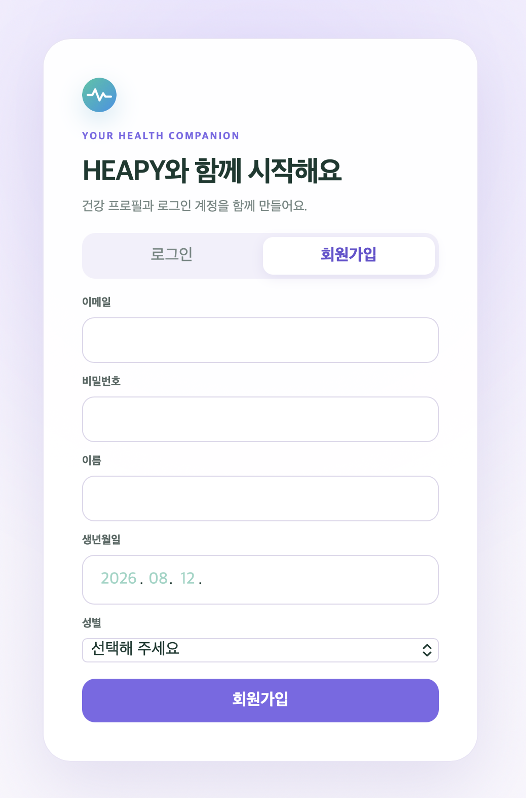
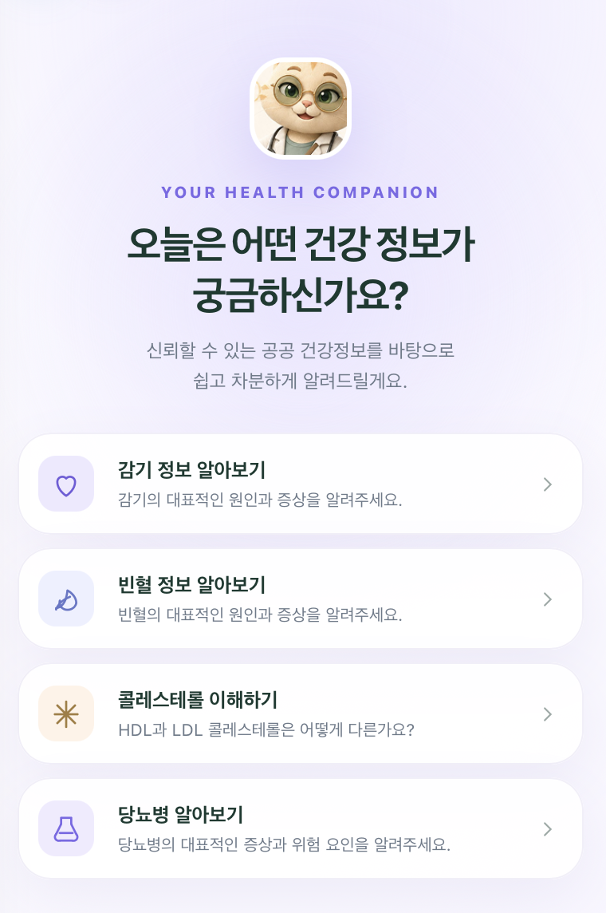
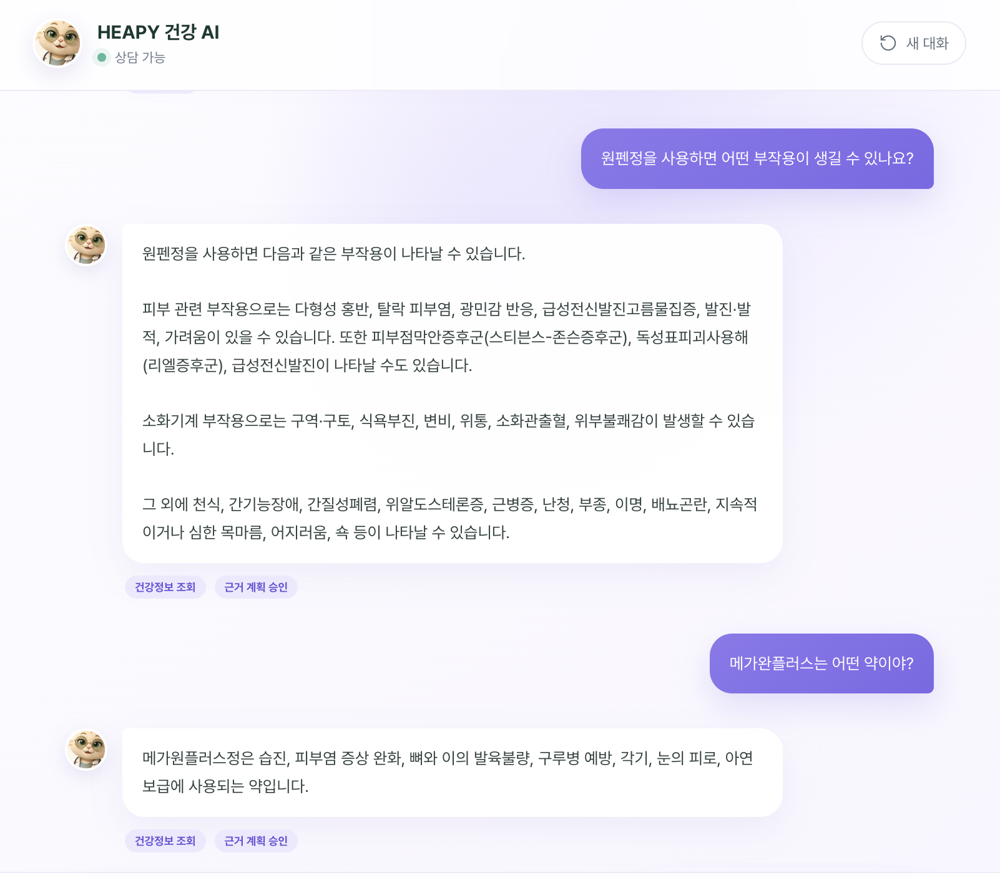
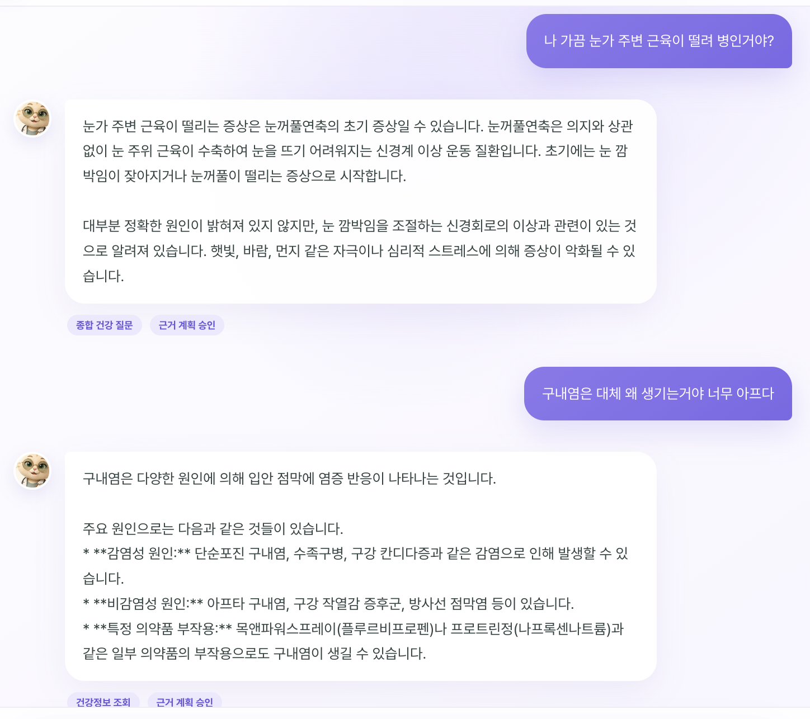

# HEAPY 건강정보 챗봇

나의 데이터와 전문 의료지식을 종합적으로 고려해 질문에 응답해주는 챗봇 서비스입니다.   
> 한국어 건강 의료정보 청크를 Pinecone에서 검색하고 사용자의 건강 정보를 Supabase에서 가져와, LLM이 응답해주는 FastAPI 서버입니다.

<table>
  <tr>
    <td align="center"></td>
    <td align="center"></td>
  </tr>
    <tr>
    <td align="center"></td>
    <td align="center"></td>
  </tr>
</table>

## 시스템 동작 흐름

```text
  → Supabase Auth 로그인 및 사용자별 대화 세션 로드
  → 사용자 질의
  → 의료용어 정규화
  → 멀티턴 후속 질문 재작성
  → 개인 건강검진·생활습관 컨텍스트 조회(RLS)
  → Pinecone namespace 검색
  → 검색·근거 검사
  → FastAPI /search, /ask
  → FastAPI 개발자 모니터링 UI 및 사용자 UI
```

## VDB 적재 정보
| 컬렉션 | Pinecone namespace | 적재 대상 |
|---|---|---:|
| 건강검진정보 | `health_checkup_info` | 30건 |
| 질병정보 | `disease_info` | 15,349건 |
| 복약정보 | `medication_info` | 43,330건 |

## 환경

- Python `3.11.9`
- 임베딩 모델 `jhgan/ko-sroberta-multitask`
- 벡터 차원 `768`
- 거리 측정 `cosine`
- Pinecone Serverless `aws / us-east-1`

## 폴더구조

```
heapy-ai-health/
├── app/                # FastAPI 서버, 라우터, 서비스, 스키마
│   ├── core/
│   ├── routers/
│   ├── services/
│   ├── schemas/
│   ├── frontends/
│   │   ├── user/       # 사용자 UI
│   │   ├── admin/      # 개발자 모니터링 UI
│   │   └── shared/     # 공용 정적 파일
│   ├── admin_frontend.py
│   └── main.py
├── database/           # Supabase DB 마이그레이션
├── model/              # model 관리
│   └── classifier/     # Intent 분류 모델 아티팩트 및 학습 스크립트
├── tests/              # 단위 테스트
├── evaluation/         # 성능 평가
├── output/             # 출력 (요소별 디버깅, 성능평가 결과 등)
├── run_admin_ui.py     # 개발자 모니터링 UI 실행 스크립트
├── requirements.txt
├── .env                # 환경변수(로컬 환경에서만 사용)
├── docs/               # 개발 문서
└── README.md
```
(`data/`, `preprocessed/`, `vdb/` 등 VDB 구축 관련 폴더는 이 저장소에 포함되지 않으며,
별도 레포지토리에서 관리됩니다.)

## 설치

```bash
python3.11 -m venv .venv
source .venv/bin/activate
pip install -r requirements.txt
```

개발 및 테스트 환경에서는 다음 의존성을 추가로 설치합니다.

```bash
pip install -r requirements-dev.txt
```

프로젝트 루트의 `.env`:

```env
PINECONE_API_KEY=your_pinecone_api_key
PINECONE_INDEX_NAME=heapy-rag
GOOGLE_API_KEY=your_gemini_api_key
SUPABASE_URL=https://your-project.supabase.co
SUPABASE_PUBLISHABLE_KEY=your_publishable_key
AUTH_COOKIE_SECURE=0
SEARCH_COLLECTIONS=health_checkup_info,disease_info,medication_info,nutrient_info
```

- `SUPABASE_PUBLISHABLE_KEY` 대신 레거시 `SUPABASE_ANON_KEY`도 사용할 수 있습니다.
- 로컬 HTTP에서는 `AUTH_COOKIE_SECURE=0`, HTTPS 운영 환경에서는 반드시 `1`로 설정합니다.  
- 설정이 완료되면 웹 앱은 Supabase 이메일·비밀번호 로그인을 먼저 요구하고, 인증 세션은 JavaScript에서 읽을 수 없는 HttpOnly 쿠키로 유지합니다.
- 회원가입 시 `auth.users` 계정과 같은 UUID의 `public.users` 프로필이 생성됩니다. 대화는 `chat_sessions`, `chat_messages`에 사용자별로 저장되며 RLS가 다른 사용자의 접근을 막습니다.
- 기존 `public.users` 데이터는 마이그레이션에서 삭제하거나 변경하지 않습니다.
- 개인 건강검진(`health_checkup_*`)과 생활습관(`lifestyle_*`) 기록은 사용자 JWT로만
  조회하며 RLS가 본인 행만 통과시킵니다. 두 컨텍스트 모두 질문에 해당하는 항목만
  선택적으로 조회해 프롬프트에 넣습니다. 생활습관은 날짜 필터 없이 최신순 건수
  제한(`LIFESTYLE_CONTEXT_MAX_ROWS`)으로 조회하므로 기기 연동이 끊겨 데이터가
  낡아도 최근 기록이 계속 조회됩니다.

- 기존 통합 임베딩 인덱스는 768차원 로컬 임베딩과 호환되지 않습니다. 별도의 `heapy-rag` dense 인덱스를 사용합니다.

## 서버 실행

### 1. FastAPI 백엔드 실행

```bash
uvicorn app.main:app --reload
```

FastAPI가 사용자용 웹 앱을 함께 제공합니다.
- 사용자 UI: <http://localhost:8000>
- Swagger: <http://localhost:8000/docs>

별도의 프론트엔드 개발 서버 없이 FastAPI가 사용자 UI를 함께 제공합니다.
웹 앱은 통합 챗봇 `POST /chat/stream`을 사용합니다.

### 2. 개발자 모니터링 UI 실행

개발자 모니터링 UI:

```powershell
python run_admin_ui.py
```

- 개발자 UI: <http://localhost:3000>
- API 서버: <http://localhost:8000>

개발자 UI는 사용자 서비스와 별도로 실행되며 프로젝트 환경, Intent·감사 로그,
검색 근거와 응답 원본 JSON을 표시합니다. 실행 전에 FastAPI 서버가 `8000` 포트에서
실행 중이어야 합니다. 회원가입·로그인·로그아웃 요청과 HttpOnly 인증 쿠키는 개발자
UI 서버가 메인 API로 중계하며, 사용자 UI와 동일한 Supabase 세션별 대화 저장을 사용합니다.

프런트엔드 정적 파일은 `app/frontends/admin`, `app/frontends/user`로 분리하며,
두 화면이 함께 사용하는 이미지는 `app/frontends/shared/images`에서 제공합니다.

## API

| 메서드 | 경로 | 설명 |
|---|---|---|
| `POST` | `/auth/signup` | 회원가입 및 사용자 프로필 생성 |
| `POST` | `/auth/login` | 로그인 및 HttpOnly 인증 쿠키 발급 |
| `POST` | `/auth/logout` | 로그아웃 및 인증 쿠키 제거 |
| `GET` | `/conversations` | 현재 사용자의 대화 세션 목록 |
| `POST` | `/conversations` | 새 대화 세션 생성 |
| `GET` | `/conversations/{session_id}` | 세션과 저장 메시지 조회 |
| `DELETE` | `/conversations/{session_id}` | 대화 세션 삭제 |
| `GET` | `/health` | Pinecone namespace별 적재 수 확인 |
| `POST` | `/chat/stream` | SSE 기반 통합 챗봇 토큰 스트리밍 |
| `POST` | `/search` | 로컬 질문 임베딩 후 Pinecone 검색 |
| `POST` | `/ask` | 검색 청크 기반 Gemini 답변 |

자세한 내용은 `docs/api_spec.md`, `docs/GRADIO_GUIDE.md`를 참고합니다.

## 운영 주의사항

- `.env`, API Key, Gemini Key를 Git에 커밋하지 않습니다.
- 개인 검진 수치와 식별정보를 공용 namespace에 적재하지 않습니다.
- 청크 ID는 재실행과 갱신을 위해 안정적으로 유지합니다.
- `--delete-stale`은 전체 원천 청크가 준비된 상태에서만 사용합니다.
- 로컬 manifest는 적재 체크포인트이며 `vdb/manifest/`에 생성됩니다. (vdb 적재 레포지토리)

## 참고 자료

- Pinecone create index: <https://docs.pinecone.io/guides/index-data/create-an-index>
- Pinecone upsert: <https://docs.pinecone.io/guides/index-data/upsert-data>
- Pinecone namespaces: <https://docs.pinecone.io/guides/index-data/implement-multitenancy>
