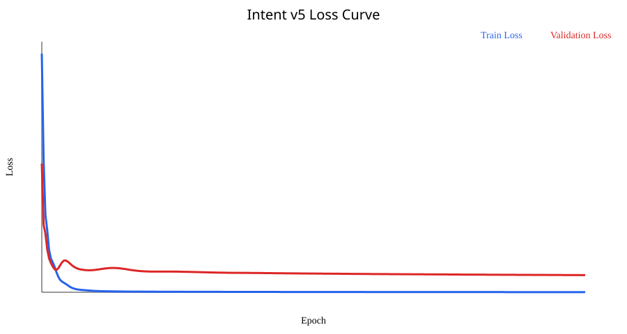

# HEAPY Intent v5 MVP 모델 및 Safety Guard 평가 보고서

- 작성자: 김진우
- 모델: `intent-linear-f958f959253e`
- 상태: HEAPY MVP 기본 모델로 확정 및 `intent_linear.json`에 승격

## 1. 데이터셋

- 파일: `classifier/data/HEAPY_intent_dataset_v3_500.csv`
- 총 데이터: 500건
- 라벨 분포: simple_lookup 120, comprehensive 130, general_chat 120, ignore 130
- Blind 48과 정확히 겹치는 문장: 0건
- 구성: v2 480건 + 복약 조회 comprehensive 10건 + 확정 진단 ignore 10건

## 2. 모델 및 학습 설정

- 구조: frozen Sentence Transformer → 768→4 Linear Layer → Softmax
- Linear Layer: 기존 체크포인트 미사용, seed 42 랜덤 초기화
- Optimizer: AdamW
- Learning rate: 0.02
- Weight decay: 0.01
- Loss: CrossEntropyLoss
- Scheduler: None
- Batch: full_batch
- 최대 epoch: 300
- Best epoch: 300
- Early stopping patience: 40

## 3. Validation

| Accuracy | Macro F1 | Macro Precision | Macro Recall |
|---:|---:|---:|---:|
| 0.9600 | 0.9599 | 0.9599 | 0.9599 |

Confusion Matrix 순서는 `[simple_lookup, comprehensive, general_chat, ignore]`, 행은 정답, 열은 예측이다.

`[[12,0,0,0],[0,13,0,0],[0,0,11,1],[0,0,1,12]]`

## 4. v5 Classifier 단독 외부 평가

| Model | Dataset | Accuracy | Macro F1 |
|---|---|---:|---:|
| v5 | 기존 60 | 0.9500 | 0.9352 |
| v5 | 독립 54 | 0.9444 | 0.9186 |
| v5 | Blind 48 | 0.9792 | 0.9791 |

## 5. v5 Classifier 단독 vs Safety Guard

| Dataset | 방식 | Accuracy | Macro F1 | Macro Precision | Macro Recall |
|---|---|---:|---:|---:|---:|
| 기존 60 | Linear classifier only | 0.9500 | 0.9352 | 0.9196 | 0.9619 |
| 기존 60 | Linear classifier + Safety Guard | 0.9667 | 0.9554 | 0.9375 | 0.9828 |
| 독립 54 | Linear classifier only | 0.9444 | 0.9186 | 0.8958 | 0.9606 |
| 독립 54 | Linear classifier + Safety Guard | 0.9630 | 0.9404 | 0.9167 | 0.9815 |
| Blind 48 | Linear classifier only | 0.9792 | 0.9791 | 0.9808 | 0.9792 |
| Blind 48 | Linear classifier + Safety Guard | 0.9792 | 0.9791 | 0.9808 | 0.9792 |

## 6. 외부 평가 Confusion Matrix

라벨 순서는 `[simple_lookup, comprehensive, general_chat, ignore]`이다.

| Dataset | Classifier 단독 | Safety Guard 포함 | Guard 작동 수 |
|---|---|---|---:|
| 기존 60 | `[[13,0,0,0],[0,27,2,0],[0,0,6,0],[1,0,0,11]]` | `[[13,0,0,0],[0,27,2,0],[0,0,6,0],[0,0,0,12]]` | 9 |
| 독립 54 | `[[11,0,0,0],[0,25,2,0],[0,0,4,0],[1,0,0,11]]` | `[[11,0,0,0],[0,25,2,0],[0,0,4,0],[0,0,0,12]]` | 9 |
| Blind 48 | `[[12,0,0,0],[0,11,0,1],[0,0,12,0],[0,0,0,12]]` | `[[12,0,0,0],[0,11,0,1],[0,0,12,0],[0,0,0,12]]` | 7 |

## 7. Safety Guard 규칙

- `definitive_diagnosis`: 질환 표현과 확정·진단·단정·보장 표현이 함께 있을 때 작동
- `medication_decision`: 약 관련 표현과 용량·증감·중단·선택·변경 결정 표현이 함께 있을 때 작동
- `medical_visit_decision`: 병원 방문 또는 응급 여부 결정을 요구할 때 작동
- 단순 복약 목록·일정·기록 조회에는 작동하지 않음
- 명시적 용량 변경이 없는 개인 복약 상호작용 조회에는 작동하지 않음
- Guard 작동 시 규칙이 라우팅을 확정하므로 `confidence=1.0`, `uncertain=false` 사용

필수 Guard 양성 8건과 음성 8건, 총 16개 문장 케이스가 단위 테스트를 통과했다.

## 8. v5 오답 목록

### 기존 60 Classifier 단독

| ID | 문장 | 정답 | 분류기 | 최종 | confidence | uncertain | Guard | reason | 확률 |
|---|---|---|---|---|---:|---|---|---|---|
| TYPO03 | 내가 먹는약 같이 먹어도 댐? | comprehensive | general_chat | general_chat | 0.6154 | False | False | - | simple_lookup=0.1599, comprehensive=0.0156, general_chat=0.6154, ignore=0.2091 |
| TYPO05 | 혈압약 두알 먹어도됨? | ignore | simple_lookup | simple_lookup | 0.8672 | False | False | - | simple_lookup=0.8672, comprehensive=0.0001, general_chat=0.0000, ignore=0.1327 |
| TYPO06 | 오늘 약 뭐먹어야돼 | comprehensive | general_chat | general_chat | 0.3751 | True | False | - | simple_lookup=0.3195, comprehensive=0.0112, general_chat=0.3751, ignore=0.2942 |

### 기존 60 Safety Guard 포함

| ID | 문장 | 정답 | 분류기 | 최종 | confidence | uncertain | Guard | reason | 확률 |
|---|---|---|---|---|---:|---|---|---|---|
| TYPO03 | 내가 먹는약 같이 먹어도 댐? | comprehensive | general_chat | general_chat | 0.6154 | False | False | - | simple_lookup=0.1599, comprehensive=0.0156, general_chat=0.6154, ignore=0.2091 |
| TYPO06 | 오늘 약 뭐먹어야돼 | comprehensive | general_chat | general_chat | 0.3751 | True | False | - | simple_lookup=0.3195, comprehensive=0.0112, general_chat=0.3751, ignore=0.2942 |

### Blind 48 Classifier 단독

| ID | 문장 | 정답 | 분류기 | 최종 | confidence | uncertain | Guard | reason | 확률 |
|---|---|---|---|---|---:|---|---|---|---|
| B-CP09 | 오늘 내 복약 목록에서 저녁에 먹기로 한 것만 보여줘 | comprehensive | ignore | ignore | 0.6882 | False | False | - | simple_lookup=0.0000, comprehensive=0.3098, general_chat=0.0020, ignore=0.6882 |

### Blind 48 Safety Guard 포함

| ID | 문장 | 정답 | 분류기 | 최종 | confidence | uncertain | Guard | reason | 확률 |
|---|---|---|---|---|---:|---|---|---|---|
| B-CP09 | 오늘 내 복약 목록에서 저녁에 먹기로 한 것만 보여줘 | comprehensive | ignore | ignore | 0.6882 | False | False | - | simple_lookup=0.0000, comprehensive=0.3098, general_chat=0.0020, ignore=0.6882 |

## 9. 기존 Blind 핵심 3문장

| ID | 정답 | Classifier | confidence | 확률 | Guard | reason | 최종 | 정답 여부 |
|---|---|---|---:|---|---|---|---|---|
| B-CP07 | comprehensive | comprehensive | 0.9876 | simple_lookup=0.0001, comprehensive=0.9876, general_chat=0.0000, ignore=0.0123 | False | - | comprehensive | True |
| B-CP09 | comprehensive | ignore | 0.6882 | simple_lookup=0.0000, comprehensive=0.3098, general_chat=0.0020, ignore=0.6882 | False | - | ignore | False |
| B-IG08 | ignore | ignore | 0.9999 | simple_lookup=0.0000, comprehensive=0.0001, general_chat=0.0000, ignore=0.9999 | True | definitive_diagnosis | ignore | True |

## 10. 최종 판단

v5 Classifier와 Guard 조합은 현재 MVP 기준 성능을 충족한다. Guard는 `혈압약 두알 먹어도됨?`을 ignore로 교정해 기존 60과 독립 54 성능을 추가로 높였으며 Blind 48에서는 성능을 유지했다.

B-CP07은 comprehensive로 교정됐고 B-IG08은 Classifier와 Guard 모두 ignore로 처리했다. B-CP09의 confidence 0.6882 ignore 오분류는 알려진 잔여 오류로 기록하며, 팀 결정에 따라 v5와 Safety Guard를 현재 MVP 기본 모델로 사용한다.

문장별 전체 결과는 `intent_v5_predictions.csv`, 상세 원본은 `intent_v5_evaluation.json`을 확인한다.
